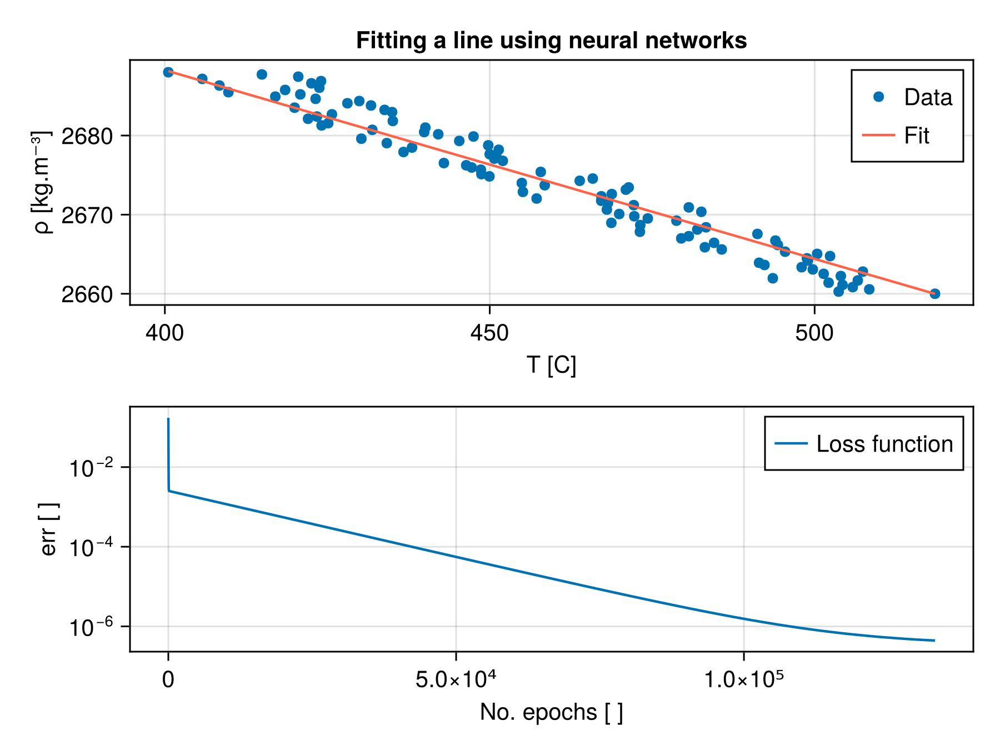

# Developers Card
Collection of showcase applications that I have developed over the years. 

## Partial differential equation (PDE) solvers
### Porous convection
Porous convection is an important physical process that describes the dynamics of fluid extraction from an essentially undeforming solid in a multiphase aggregate. Applications include industrial filtration systems, subsurface hydrogeological reservoirs, or melt extraction below a volcano. The movie below shows porous convection across a 2D domain. To calculate the fluid motion through the pore space, Darcy's equation is coupled to the Heat equation. The solution is obtained iteratively applying a pseudo-transient time stepping method.

| Attribute           | Value                      |
| :------------------ | :------------------------- |
| Physics             | Darcy's law + Heat equation|
| Method              | central finite differences |
| Time integration    | fully implicit             |
| Advection scheme    | upwind (first order)       |
| Programmed language | Julia                      |
| Parallelization     | no                         |
| Rayleigh-No         | 1000                       |
| Porosity            | 10 % (const.)              |

https://github.com/lcandiot/DevelopersCard/assets/50524459/24bbff85-92bd-4f90-a380-bb2f09f45e02

## Data Analysis
### Fitting data using neural networks
The following figure shows an example of fitting the temperature-dependent rock density using neural networks. The linear regression algorithm was developed using the Flux.jl package.

